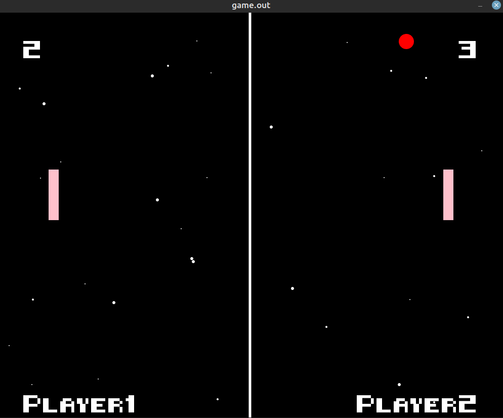

A naive pong game written in C. <br>

Library - [allegro](https://liballeg.org/) <br>
Its actually turning out to be really bad... The collisions are glitchy, and the ball's speed is not consistent but it seems playable. <br>



To run... <br>

1) clone
```bash
git clone https://github.com/OmiSingh04/allegro_pong.git
cd allegro_pong
```

2) Change file mode (only once)

```bash
sudo chmod +x run.sh
```

3) run the script (library must be installed, i just got it off apt)

```bash
./run.sh
```

Must have allegro installed!